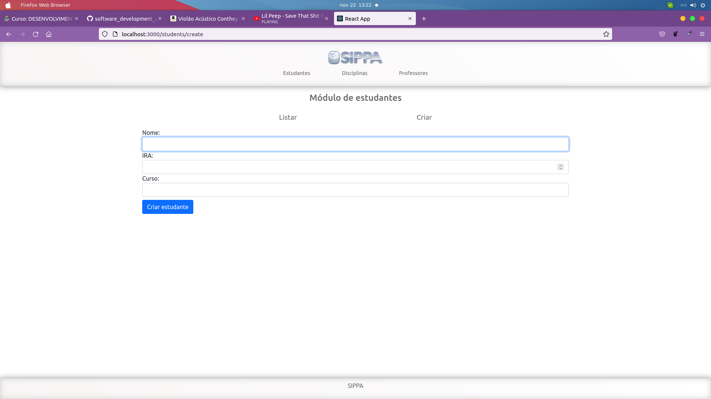
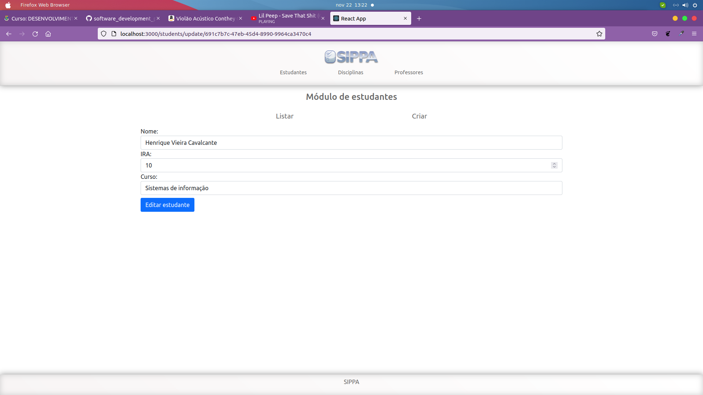
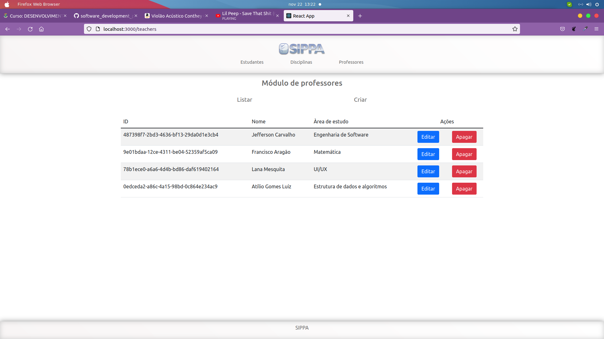
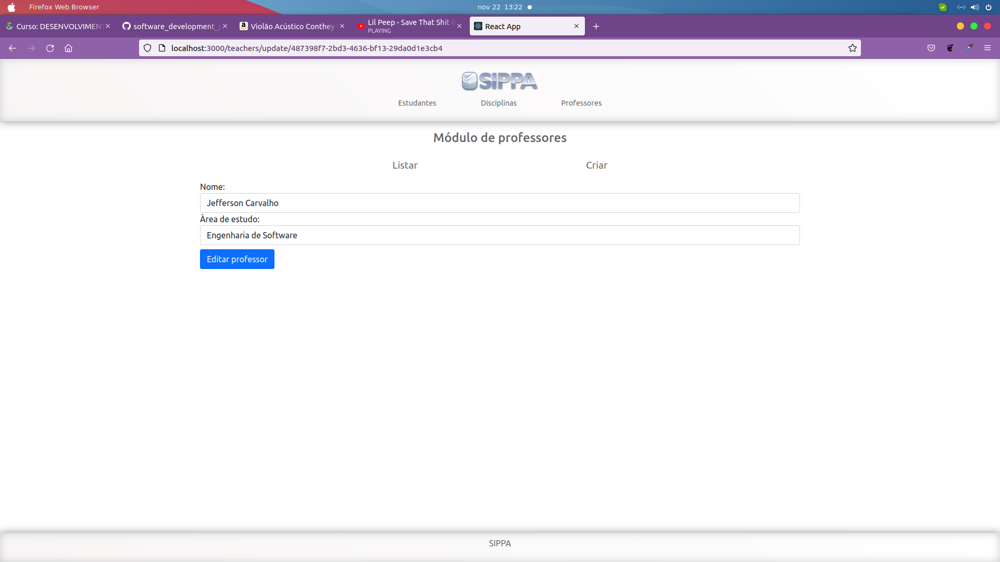
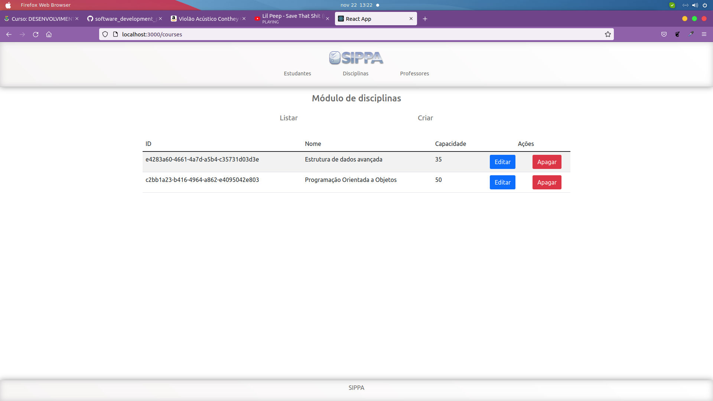
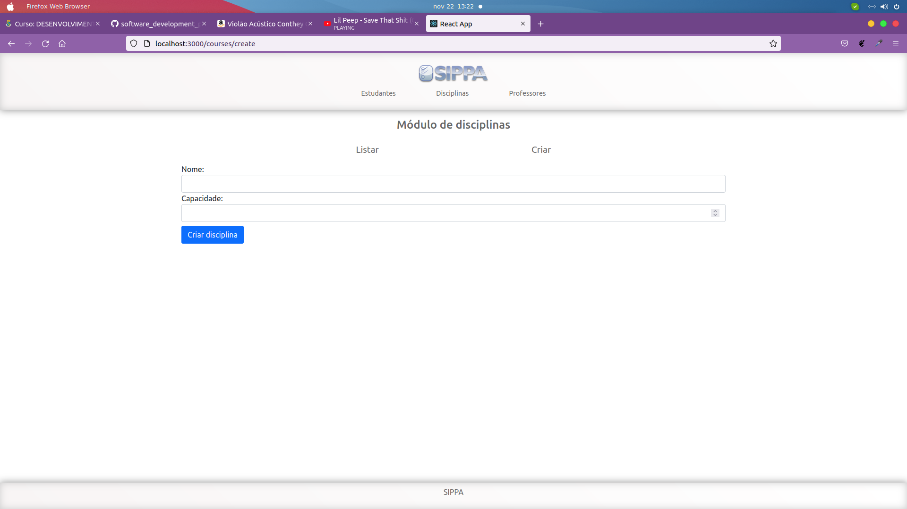
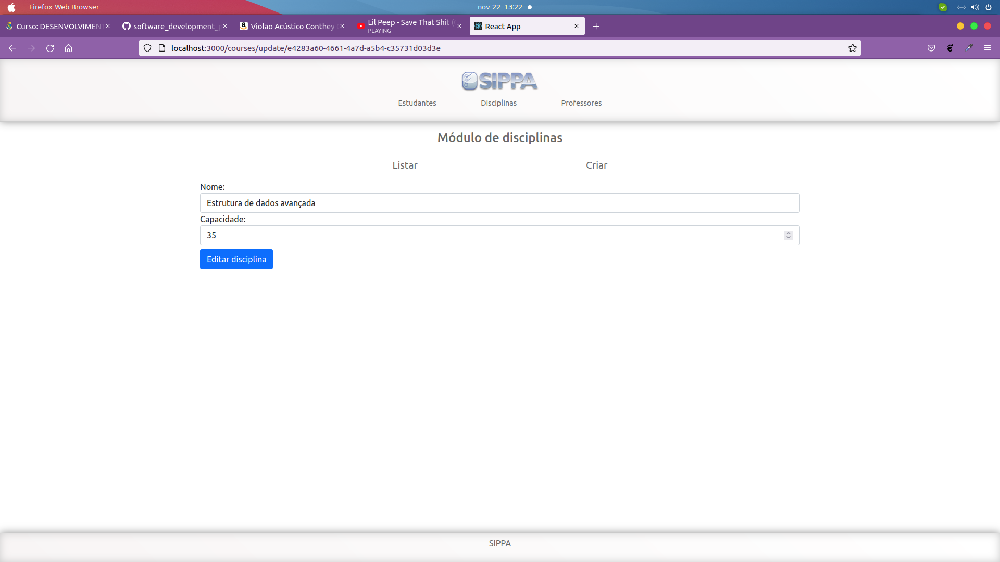

## Projeto CRUD com express

### O que fiz?
- Basicamente é a mesma aplicação que a TASK_04 só que ao invés de um json mocado, é utilizado o mongodb com o mongoose;

## Preview

### Módulo de estudantes

#### Listar

#### Criar

#### Atualizar

### Módulo de Professores

#### Listar

#### Criar

#### Atualizar

### Módulo de disciplinas

#### Listar

#### Criar

#### Atualizar
