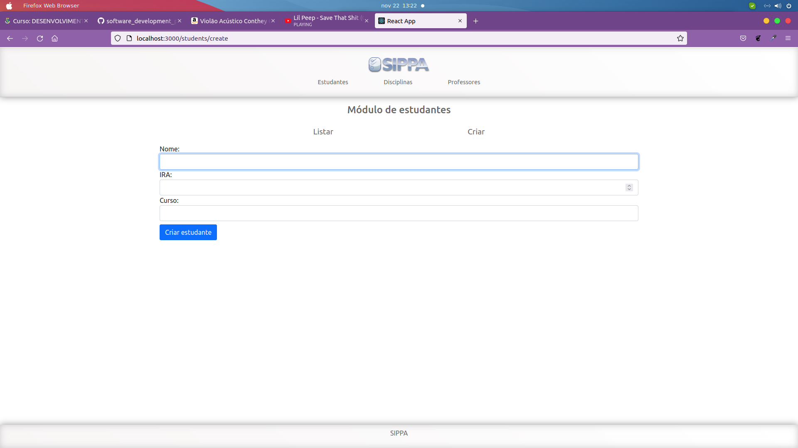
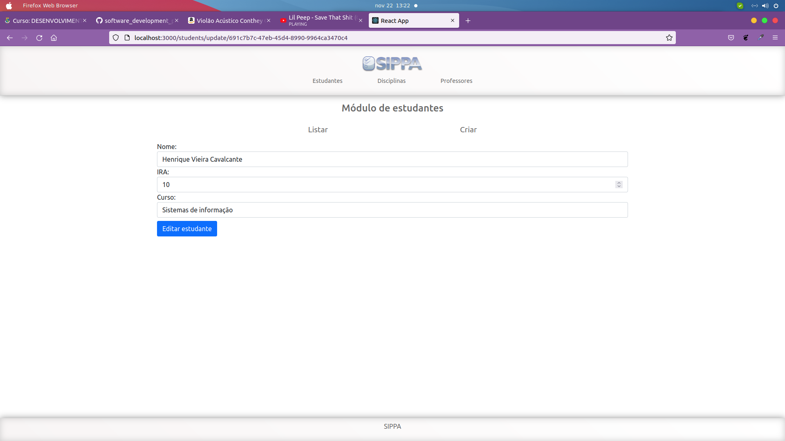
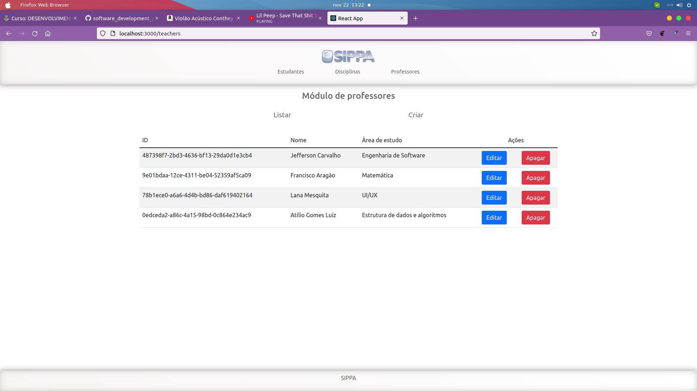
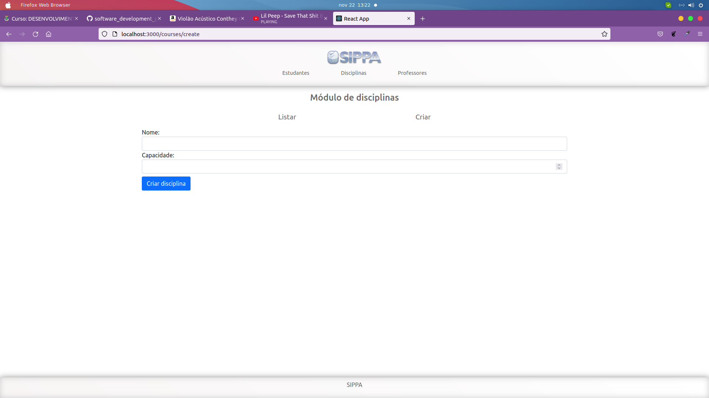

## Projeto CRUD com express

### O que fiz?
- Basicamente é a mesma aplicação que a TASK_04 só que ao invés de um json mocado, é utilizado o mongodb com o mongoose;

### Como rodar?

- Vá no backend e crie um arquivo .env
   - insira a url do seu mongodb no .env: ex: "MONGO_URL=sua_url"
- Ainda na pasta backend rode um "npm install"
- No final rode: npm run start 

- Vá no frontend e instale as dependências:
  - npm install
- No final rode: npm run start

## Preview

### Módulo de estudantes

#### Listar

#### Criar

#### Atualizar

### Módulo de Professores

#### Listar

#### Criar

#### Atualizar

### Módulo de disciplinas

#### Listar

#### Criar

#### Atualizar

