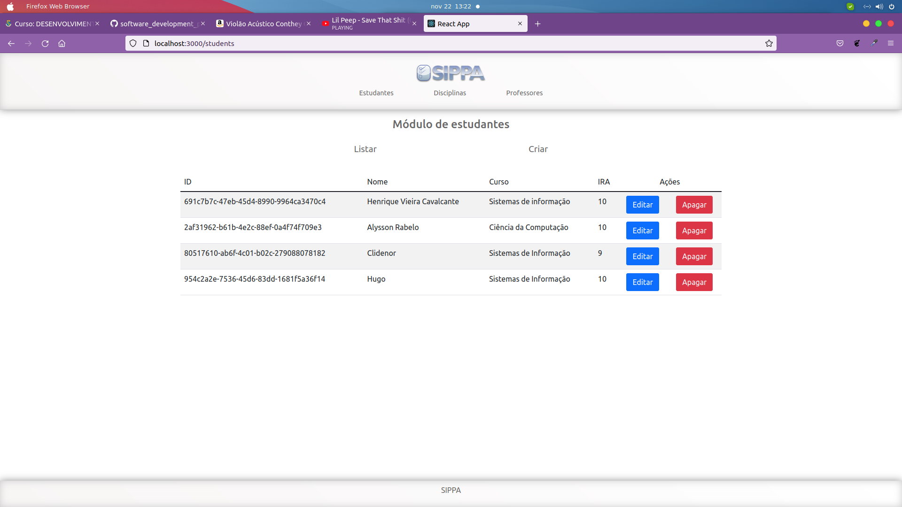
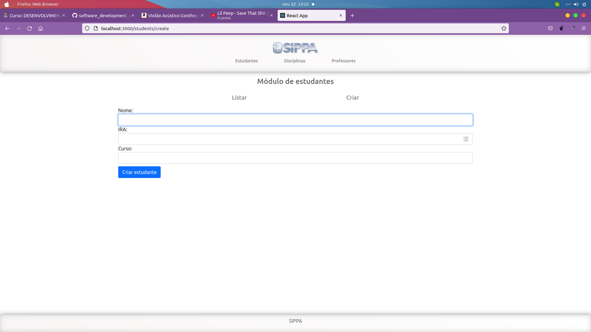

## Projeto CRUD com firebase

### O que fiz?
- Basicamente é a mesma aplicação que a TASK_06 só que ao invés de um backend com express é usado o firestore do firebase;
### Como rodar?

- Vá no frontend e crie um arquivo .env.json
 - Insira as seguintes informações do seu firestore
 ```json
 {
  "FIREBASE": {
    "FIREBASE_API_KEY":"YOUR_FIREBASE_API_KEY",
    "FIREBASE_AUTH_DOMAIN":"YOUR_FIREBASE_AUTH_DOMAIN",
    "FIREBASE_PROJECT_ID":"YOUR_FIREBASE_PROJECT_ID",
    "FIREBASE_STORAGE_BUCKET":"YOUR_FIREBASE_STORAGE_BUCKET",
    "FIREBASE_MESSAGING_SENDER_ID":"YOUR_FIREBASE_MESSAGING_SENDER",
    "FIREBASE_APP_ID":"YOUR_FIREBASE_APP_ID"
  }
}
 ```
- Abra a pasta frontend no terminal e rode:
  - npm i ou yarn install para instalar as dependências
- Por fim, rode npm run start para abrir a aplicação

## Preview

### Módulo de estudantes

#### Listar

#### Criar

#### Atualizar


### Módulo de Professores

#### Listar

#### Criar

#### Atualizar


### Módulo de disciplinas

#### Listar

#### Criar

#### Atualizar

