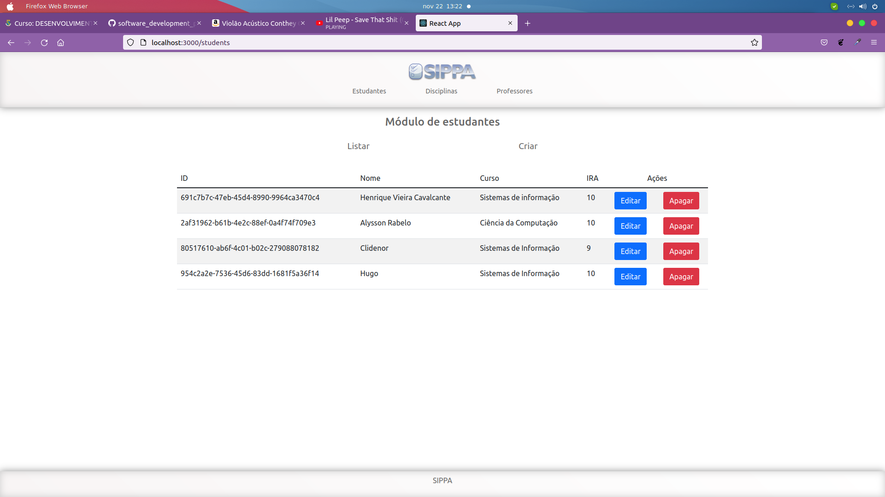

## Projeto CRUD com express

### O que fiz?
- Basicamente fiz um crud de professores, alunos e disciplinas simulando um "sippa"
- No backend resolvi utilizar um banco de dados como um json mocado.

## Preview

### Módulo de estudantes

#### Listar

#### Criar

#### Atualizar

### Módulo de Professores

#### Listar

#### Criar

#### Atualizar

### Módulo de disciplinas

#### Listar

#### Criar

#### Atualizar
